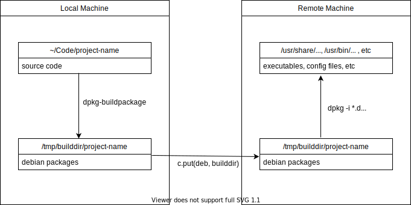

# Build and Install

## Overview

Occasionally the best way to test a change is to manual test on the real system. To do this the developer has to:

1. Build the debian packages.
2. Copy the packages to the remote machine.
3. Install the packages.

## Usage

### Script Variables

| Variable        | Description                                              | Default            |
| --------------- | -------------------------------------------------------- | ------------------ |
| username        | User of remote machine                                   | vyatta             |
| password        | Password for remote machine                              | vyatta             |
| builddir_prefix | Prefix for location to deposit debs (on remote and host) | /var/tmp/buildDir/ |
| ip_addr         | IP address if the remote machine                         | None               |

### Command line Arguments

Argument 1: Target machine's IP address.  
Example: `build_and_install.py 192.168.252.25`
